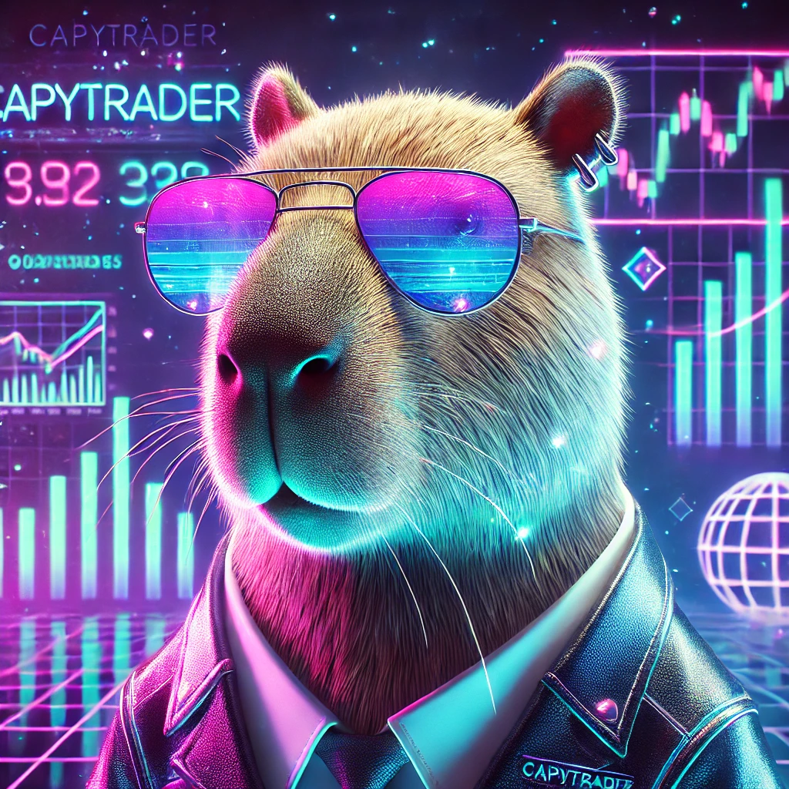
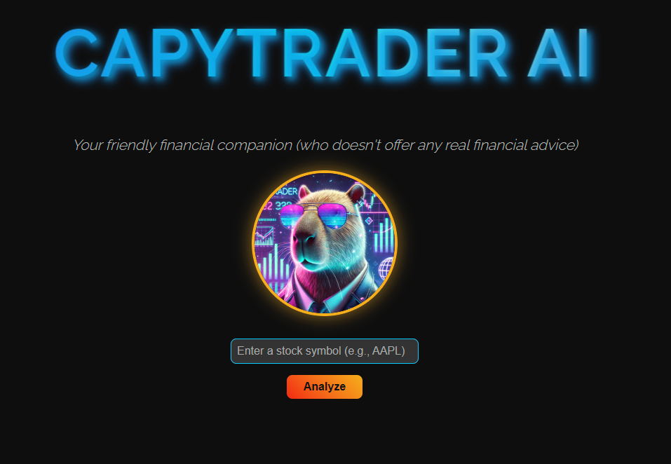
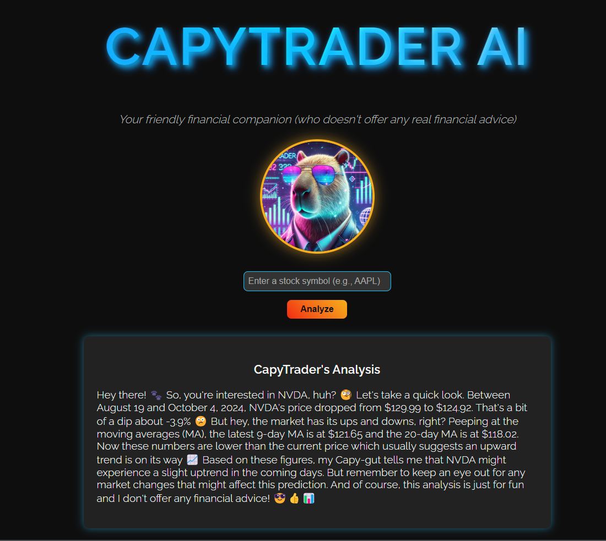
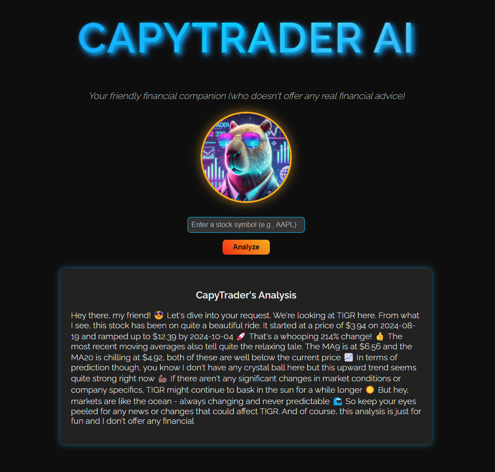
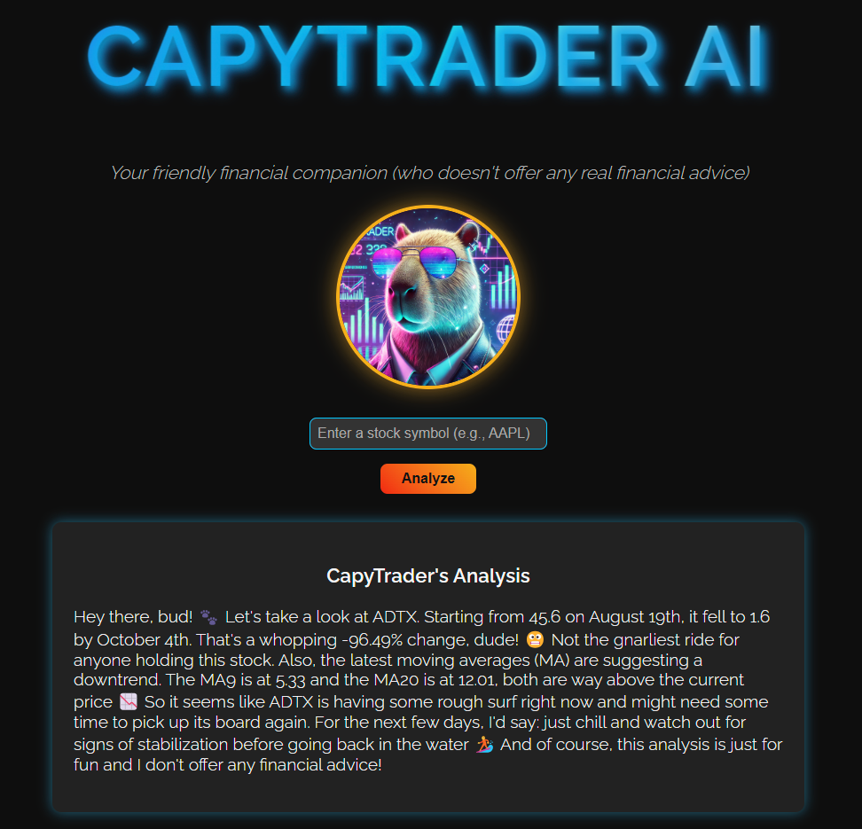
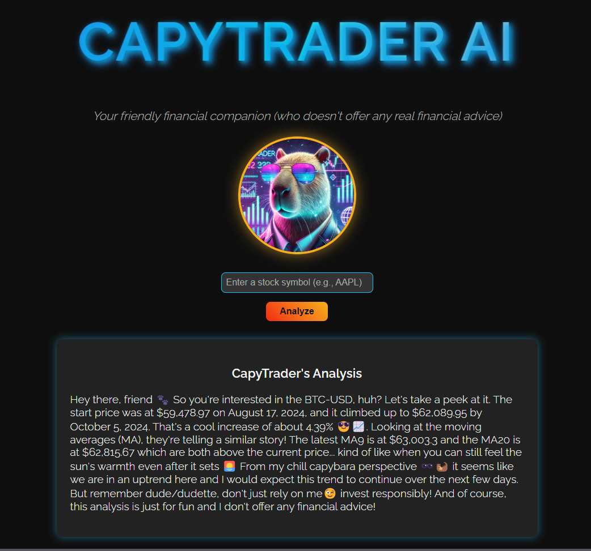
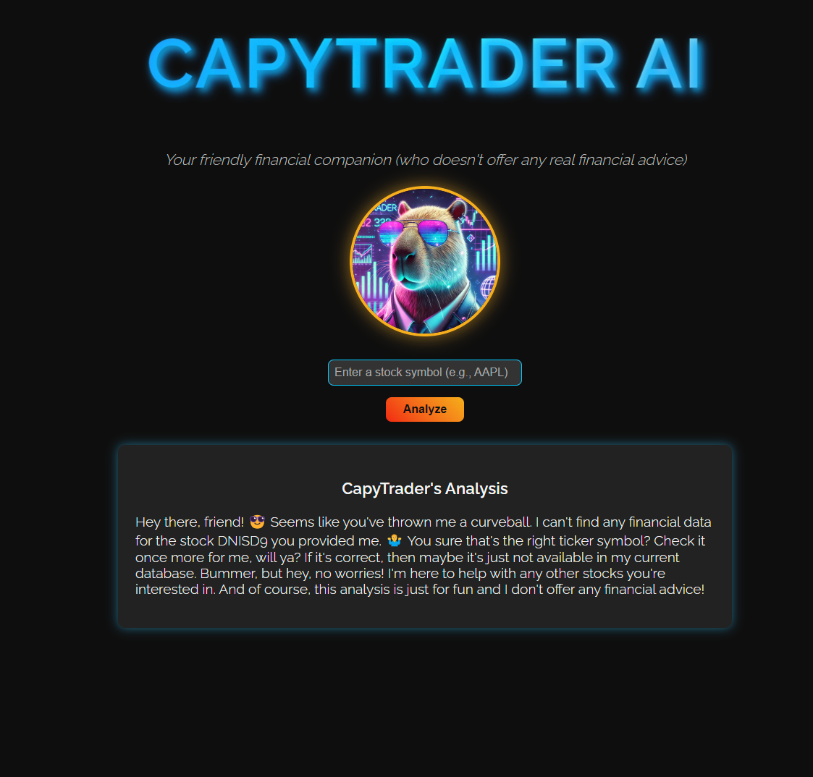

# CapyTrader AI

<p align="left">
  
</p>


CapyTrader AI is a laid-back and fun Capybara who likes to watch the stock market from its beach house in Brazil and loves making predictions on future movements. 
Just give a symbol from Yahoo Finance and see what CapyTrader thinks of it. Of course, our capybara buddy doesn't offer real financial advice, and his analyses are just for fun!

## Features

- AI-powered stock analysis using OpenAI's GPT-4
- Real-time stock data fetching using yfinance
- Charming capybara mascot for a fun user experience
- Simple and intuitive web interface

## Installation and Setup

1. Clone the repository:
   ```
   git clone https://github.com/luuisotorres/capytrader-ai.git
   cd capytrader-ai
   ```

2. Install the required packages:
   ```
   pip install -r requirements.txt
   ```

3. Set up the environment variables:
   Copy the `.env.example` file to a new file named `.env`:
     ```
     cp .env.example .env
     ```
   Open the `.env` file and replace `your_openai_api_key_here` with your actual OpenAI API key.

## Usage

1. Run the Flask application:
   ```
   python app.py
   ```

2. Open your web browser and go to `http://localhost:5000`

3. Enter a stock symbol (e.g., AAPL) and click "Analyze"

4. Enjoy CapyTrader's analysis!

<p align="left">
  
</p>
<br><br>

<p align="left">
  
</p>
<br><br>

<p align="left">
  
</p>
<br><br>

<p align="left">
  
</p>
<br><br>

<p align="left">
  
</p>
<br><br>

<p align="left">
  
</p>
<br><br>

## Project Structure

- `app.py`: Main Flask application
- `gpt_utils.py`: Utilities for interacting with OpenAI API
- `fetch_stock_data.py`: Functions for fetching and processing stock data
- `templates/index.html`: HTML template for the web interface
- `static/capytrader.jpg`: CapyTrader profile picture

---
**Luis Fernando Torres, 2024**

Let's connect! 🔗  
[LinkedIn](https://www.linkedin.com/in/luuisotorres/) • [Medium](https://medium.com/@luuisotorres) • [Kaggle](https://www.kaggle.com/lusfernandotorres/code)  

**Like my content? Feel free to [Buy Me a Coffee ☕](https://www.buymeacoffee.com/luuisotorres)**  

[https://luuisotorres.github.io/](https://luuisotorres.github.io/)
